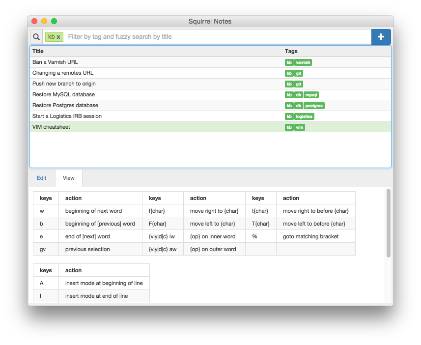

# Squirrel Notes
Squirrel Notes is a simple notes application, inspired by [National Velocity](http://notational.net) and [nvALT](http://brettterpstra.com/projects/nvalt/). Its purpose is to allow the creation of rich HTML rendered notes, while allowing lightning fast retrieval using tags and fuzzy searching.



## Motivation
I love the simplicity and `stay out of your way` style of NV and nvALT, but their lack of built in HTML rendering lets them down. Also this was the perfect opportunity to take [Electron](https://github.com/atom/electron) for a spin.

## Dependencies
- [NPM 3](http://blog.npmjs.org/post/122450408965/npm-weekly-20-npm-3-is-here-ish) (`npm install -g npm@3.0-latest`)
- [Gulp](https://www.npmjs.com/package/gulp) (globally installed)
- [Babel](https://www.npmjs.com/package/babel) (globally installed)

## Development
To set up a development environment, simply do:
```sh
git clone git@github.com:christian-schulze/SquirrelNotes.git
cd squirrelnotes
npm install --dev
gulp build
```
Then you can:
```sh
gulp build # build everything into the app folder
gulp watch # rebuild when something changes
gulp package # Create a stand-alone application in the packages folder
npm start # start the app in development mode
```

## TODO
- [ ] Add note
- [ ] Rename note (change title)
- [ ] Delete note
- [ ] Optimize for keyboard-only use (mouse should be completely optional)
- [ ] Allow vertical resizing of results table (and persist the size)
- [ ] Rework html/css layout, so resizing works better
- [ ] Implement better editor ([AlloyEditor](http://alloyeditor.com))
- [ ] Add auto-updater (when new build is available)
- [ ] Refactor using the flux pattern (specifically [Redux](https://github.com/rackt/redux))
- [ ] Add tests ([electron-mocka](https://github.com/jprichardson/electron-mocha) and/or [selenium/webdriver](http://electron.atom.io/docs/v0.31.0/tutorial/using-selenium-and-webdriver/))

## License
[MIT](./LICENSE)
